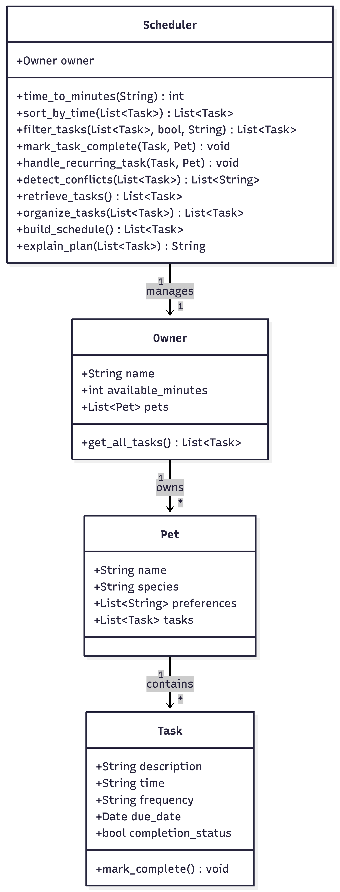

# PawPal+ (Module 2 Project)

You are building **PawPal+**, a Streamlit app that helps a pet owner plan care tasks for their pet.

## Scenario

A busy pet owner needs help staying consistent with pet care. They want an assistant that can:

- Track pet care tasks (walks, feeding, meds, enrichment, grooming, etc.)
- Consider constraints (time available, priority, owner preferences)
- Produce a daily plan and explain why it chose that plan

Your job is to design the system first (UML), then implement the logic in Python, then connect it to the Streamlit UI.

## What you will build

Your final app should:

- Let a user enter basic owner + pet info
- Let a user add/edit tasks (duration + priority at minimum)
- Generate a daily schedule/plan based on constraints and priorities
- Display the plan clearly (and ideally explain the reasoning)
- Include tests for the most important scheduling behaviors

## Getting started

### Setup

```bash
python -m venv .venv
source .venv/bin/activate  # Windows: .venv\Scripts\activate
pip install -r requirements.txt
```

### Suggested workflow

1. Read the scenario carefully and identify requirements and edge cases.
2. Draft a UML diagram (classes, attributes, methods, relationships).
3. Convert UML into Python class stubs (no logic yet).
4. Implement scheduling logic in small increments.
5. Add tests to verify key behaviors.
6. Connect your logic to the Streamlit UI in `app.py`.
7. Refine UML so it matches what you actually built.

## Smarter Scheduling

The PawPal+ scheduler includes advanced features for efficient pet care planning:

- **Time-Based Sorting**: Tasks are sorted by duration using HH:MM format parsing for accurate ordering.
- **Flexible Filtering**: Filter tasks by completion status or specific pets to focus on relevant care.
- **Recurring Tasks**: Automatically creates new task instances for daily/weekly routines when marked complete, using Python's `timedelta` for date calculations.
- **Conflict Detection**: Lightweight checks warn about pet overload (multiple tasks per pet) and time overruns, ensuring feasible schedules without complex time slot management.

## Features

- **Smart Task Sorting** — Organize pet care activities chronologically to build efficient daily schedules
- **Time-Based Conflict Detection** — Automatic warnings when task duration exceeds available time or a pet has overlapping priorities
- **Daily & Weekly Recurrence** — Set recurring tasks that automatically regenerate after completion for seamless ongoing care
- **Priority-Based Scheduling** — Intelligent algorithm that prioritizes incomplete tasks and fits them within your available time
- **Multi-Pet Coordination** — Manage care tasks across multiple pets with conflict tracking and individual pet preferences
- **Task Filtering & Organization** — View tasks by completion status, pet, or time to stay organized
- **Care Plan Explanation** — Detailed schedule summaries showing what tasks fit your time and why, with actionable conflict warnings

## 📸 Demo

  <!-- Replace with actual screenshot of your Streamlit app -->

## Testing PawPal+

Run the test suite with:
```bash
python3 -m pytest tests/test_pawpal.py
```

The tests cover core behaviors including task completion, addition, sorting by time, recurring task automation, and conflict detection for pet overload and time constraints.

**Confidence Level**: ⭐⭐⭐⭐⭐ (5/5 stars) - All tests pass, covering happy paths and edge cases, ensuring reliable scheduling logic.
